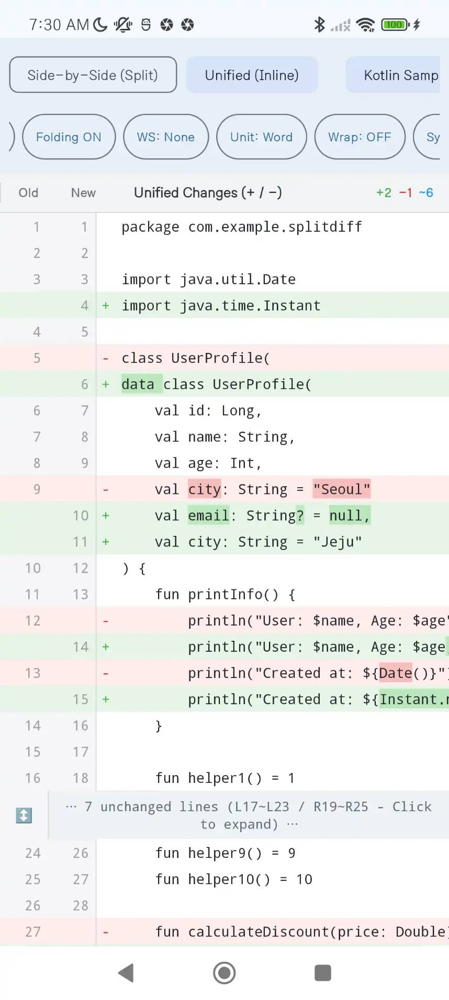

# DiffView

An Android Studio Diff Editor styled **Side-by-Side (Split) & Unified DiffView** Android library.

[](https://jitpack.io/#dajkim76/DiffView)
[](https://opensource.org/licenses/Apache-2.0)

---

## 🌟 Key Features

0. **Powered by AI**:
   - Most of the codebase was generated with **Gemini 3.7 Flash**. If you encounter issues, feel free to clone the repository and improve the code using AI. This documentation was also generated with AI.
1. **2 Diff Modes Supported**:
   - **Side-by-Side (Split) Mode**: Displays Original (left) and Modified (right) in 2 parallel columns with synchronized line alignment.
   - **Unified Mode**: Displays changes in a single vertical stream (`+` / `-`).
2. **Synchronized Vertical Scrolling**:
   - Built on a single `RecyclerView` view-recycling architecture, ensuring 100% synchronized vertical scrolling without 1px misalignment and smooth rendering even for thousands of lines.
3. **Column-wise Synchronized Horizontal Scrolling**:
   - Short lines and long lines share the same virtual canvas width. Dragging any line horizontally scrolls all lines on that side together seamlessly.
   - Left and right sides scroll horizontally independently.
4. **Inline Diff (Word / Character Level Highlights & Configurable Granularity)**:
   - Applies LCS algorithm on modified lines to highlight exact changed parts by words (`DiffGranularity.WORD`, default) or characters (`DiffGranularity.CHARACTER`).
   - Dynamically switch granularity via `setDiffGranularity(...)`.
5. **Git / Android Studio Style Context-aware Folding**:
   - Preserves surrounding context lines (`contextLines`, default: 3) around changes, while collapsing long unchanged blocks into `⋯ N lines unchanged ⋯` banners.
   - Supports individual block expanding/collapsing on banner click, as well as `expandAll()` / `collapseAll()`.
6. **4 Whitespace Ignore Modes**:
   - `NONE`: Strict whitespace comparison (default)
   - `TRIM_LEADING_TRAILING`: Ignore leading and trailing indentations
   - `COLLAPSE_WHITESPACE`: Ignore consecutive whitespace count differences
   - `IGNORE_ALL`: Ignore all whitespace characters
7. **Line Wrap Support**:
   - Enable `setLineWrap(true)` to wrap long lines to fit the screen width instead of horizontal scrolling.
8. **Multi-language Syntax Highlighting & Dark Theme**:
   - Plain text by default (`PlainTextSyntaxHighlighter`), with built-in highlighters for major programming languages:
     - Kotlin (`KotlinSyntaxHighlighter`)
     - Java (`JavaSyntaxHighlighter`)
     - JavaScript / TypeScript (`JavaScriptSyntaxHighlighter`)
     - Python (`PythonSyntaxHighlighter`)
     - C / C++ (`CppSyntaxHighlighter`)
     - C# (`CSharpSyntaxHighlighter`)
     - Auto-detection by filename or extension: `SyntaxHighlighter.forFileName("main.py")` or `SyntaxHighlighter.forExtension("js")`
9. **Customizable UI Labels & Multi-language Support**:
   - Easily customize all UI strings (headers, folding banner formats) via `DiffLabels` or `setDiffLabels()`, `setHeaderTitles()`, `setUnifiedHeaderTitle()`.
   - Built-in string resources in English and Korean (`values-ko/strings.xml`).
10. **Diff Change Symbols (`-` / `+`)**:
    - `setShowDiffSymbols(true)` displays `-` (deleted) and `+` (added) indicators in front of code lines in Side-by-Side mode (default: `true`).
11. **Adjustable Gutter (Line Number) Width**:
    - `setGutterWidthDp(50)` allows adjusting the line number gutter width (default: `42dp`).
12. **Line Long-Press Action (None, Text Selection & Code Comments)**:
    - Configure long-press interaction via `setLongTabAction(DiffLongTabAction.NONE)` (default: `NONE`).
    - Options: `NONE`, `TEXT_SELECTABLE` (drag selection/copying), `COMMENT` (line comment dialog).
13. **Header Settings (⚙️) & More (⋮) Action Menus**:
    - **Settings (⚙️)**: Interactive modal dialog to adjust all DiffView configurations in real-time.
    - **More (⋮)**: Popup menu for exporting diffs as images (**Visible Viewport** or **Full Diff**). Automatically provides **View** and **Share** dialog actions upon completion.
    - Programmatically trigger via `showSettingsDialog()`, `showMoreMenu()`, or `executeImageCapture(isFull)`.
    - Toggle header action buttons via `setSettingsButtonVisible(boolean)` or `setMoreButtonVisible(boolean)`.
14. **Multi-language Presets & Customizable Labels (`DiffSettingLabels`, `DiffCommentLabels`)**:
    - Built-in localization presets for **17 languages**: English, Korean (`ko`), Japanese (`ja`), Simplified Chinese (`zh-CN`), Traditional Chinese (`zh-TW`), Spanish (`es`), French (`fr`), German (`de`), Portuguese (`pt`), Russian (`ru`), Italian (`it`), Indonesian (`in`), Vietnamese (`vi`), Thai (`th`), Hindi (`hi`), Arabic (`ar`), and Turkish (`tr`).
    - Fully customize all UI strings for settings, image exporting, and code comment dialogs via `DiffSettingLabels` and `DiffCommentLabels`.
15. **Settings Persistence via SharedPreferences (`DiffViewPreferences`)**:
    - Easily persist and restore all DiffView viewer configurations (diff mode, theme, text size, folding, whitespace, wrap, symbols, and long-press action) using `diffView.savePreferences()` and `diffView.loadPreferences()`.
    - Supports auto-saving directly from the settings dialog (`diffView.showSettingsDialog(autoSave = true)`).
16. **Screenshots**




---

## 📦 Installation (JitPack)

### 1. Add JitPack repository in `settings.gradle.kts`

```kotlin
dependencyResolutionManagement {
    repositoriesMode.set(RepositoriesMode.FAIL_ON_PROJECT_REPOS)
    repositories {
        google()
        mavenCentral()
        maven { url = uri("https://jitpack.io") }
    }
}
```

### 2. Add dependency in `build.gradle.kts` (Module :app)

```kotlin
dependencies {
    implementation("com.github.dajkim76:DiffView:1.0.4")
}
```

### 3. Storage Permissions (Optional — for Android 9 and below)

- **Android 10+ (API 29+)**: Uses **Scoped Storage** (`MediaStore`). **No storage permissions required** to export diff images to `Pictures/DiffView`.
- **Android 9 and below (API ≤ 28)**: If your app targets and runs on Android 9 or lower and uses image export, declare the legacy write permission in your `AndroidManifest.xml`:
  ```xml
  <uses-permission
      android:name="android.permission.WRITE_EXTERNAL_STORAGE"
      android:maxSdkVersion="28" />
  ```

---

## 📁 Project Structure

```text
DiffView/
├── diffview/                               # 📦 Core Android Library Module (Distribution Target)
│   └── src/main/
│       ├── java/com/mdiwebma/diffview/
│       │   ├── DiffView.kt                 # Main custom FrameLayout DiffView component (settings, image export, API)
│       │   ├── DiffViewAdapter.kt          # Side-by-Side & Unified RecyclerView Adapter
│       │   ├── DiffViewPreferences.kt      # SharedPreferences persistence model & helpers
│       │   ├── DiffSettingDialog.kt        # Interactive real-time settings modal dialog
│       │   ├── DiffSettingLabels.kt        # Settings & image export UI labels model
│       │   ├── DiffColors.kt               # Android Studio Light / Dark color theme palette
│       │   ├── DiffLabels.kt               # Header & folded banner UI labels model
│       │   ├── SyntaxHighlighter.kt        # Syntax highlighting (Kotlin, Java, JS, Python, C++, C#)
│       │   ├── FoldingManager.kt           # Git/AS-style context-aware unchanged line folding manager
│       │   ├── SyncHorizontalScrollView.kt # Column-wise synchronized horizontal scroll view
│       │   ├── comment/                    # 💬 Code line comment system
│       │   │   ├── CodeComment.kt          # Comment data model
│       │   │   ├── CodeCommentManager.kt   # Comment CRUD operations manager
│       │   │   ├── CodeCommentHelper.kt    # Comment input/edit/delete modal dialog helpers
│       │   │   ├── DiffCommentLabels.kt    # Comment dialog UI localization labels
│       │   │   └── LineKey.kt              # Left/Right line identifier key
│       │   ├── engine/                     # ⚙️ Diff calculation engine
│       │   │   ├── DiffEngine.kt           # Diff computation interface
│       │   │   ├── KotlinDiffEngine.kt     # Myers diff engine implementation
│       │   │   └── InlineDiffCalculator.kt # Word & Character level inline difference calculator
│       │   └── model/                      # 📐 Data models
│       │       └── DiffModels.kt           # DiffRow, DiffLine, DiffMode, WhitespaceIgnoreMode, DiffGranularity
│       └── res/                            # 🌐 Localization resources (17 Language Presets)
│           ├── values/                     # Default (English)
│           ├── values-ko/                  # Korean (한국어)
│           ├── values-ja/                  # Japanese (日本語)
│           ├── values-zh-rCN/              # Simplified Chinese (简体中文)
│           ├── values-zh-rTW/              # Traditional Chinese (繁體中文)
│           ├── values-es/                  # Spanish (Español)
│           ├── values-fr/                  # French (Français)
│           ├── values-de/                  # German (Deutsch)
│           ├── values-pt/                  # Portuguese (Português)
│           ├── values-ru/                  # Russian (Русский)
│           ├── values-it/                  # Italian (Italiano)
│           ├── values-in/                  # Indonesian (Bahasa Indonesia)
│           ├── values-vi/                  # Vietnamese (Tiếng Việt)
│           ├── values-th/                  # Thai (ไทย)
│           ├── values-hi/                  # Hindi (हिन्दी)
│           ├── values-ar/                  # Arabic (العربية)
│           └── values-tr/                  # Turkish (Türkçe)
│
└── app/                                    # 📱 Demo Application (Samples with ObjectBox history & live editing)
```

---

## 🚀 Basic Usage

### 1. Add to XML Layout

```xml
<com.mdiwebma.diffview.DiffView
    android:id="@+id/diffView"
    android:layout_width="match_parent"
    android:layout_height="match_parent" />
```

### 2. Control in Kotlin Code

```kotlin
import com.mdiwebma.diffview.KotlinSyntaxHighlighter
import com.mdiwebma.diffview.DiffColors
import com.mdiwebma.diffview.DiffLabels
import com.mdiwebma.diffview.DiffSettingLabels
import com.mdiwebma.diffview.DiffView
import com.mdiwebma.diffview.comment.DiffCommentLabels
import com.mdiwebma.diffview.model.DiffGranularity
import com.mdiwebma.diffview.model.DiffLongTabAction
import com.mdiwebma.diffview.model.DiffMode
import com.mdiwebma.diffview.model.WhitespaceIgnoreMode

val diffView = findViewById<DiffView>(R.id.diffView)

// 1. Set original and modified source codes (Async computation & rendering)
val originalCode = """
    fun calculate(x: Int): Int {
        return x * 2
    }
""".trimIndent()

val modifiedCode = """
    fun calculate(x: Int, factor: Int = 2): Int {
        return x * factor
    }
""".trimIndent()

diffView.setContent(original = originalCode, modified = modifiedCode)

// 2. Set Diff mode (default: SIDE_BY_SIDE)
diffView.setDiffMode(DiffMode.SIDE_BY_SIDE) // 2-column split mode
// diffView.setDiffMode(DiffMode.UNIFIED)    // 1-column unified inline mode

// 3. Set Color Theme (Light / Dark), Default is Auto
diffView.setDiffColors(DiffColors.Dark)

// 4. Set font size (SP unit)
diffView.setTextSize(13f)

// 5. Configure context-aware folding (enabled, context lines, threshold)
diffView.setFoldingEnabled(enabled = true, contextLines = 3, threshold = 8)

// 6. Expand / Collapse all folded blocks
diffView.expandAll()
diffView.collapseAll()

// 7. Configure whitespace ignore mode (NONE, TRIM_LEADING_TRAILING, COLLAPSE_WHITESPACE, IGNORE_ALL)
diffView.setWhitespaceIgnoreMode(WhitespaceIgnoreMode.TRIM_LEADING_TRAILING)

// 8. Configure inline diff granularity (WORD (default) vs CHARACTER)
diffView.setDiffGranularity(DiffGranularity.WORD)

// 9. Enable line wrapping (default: false - horizontal scrolling)
diffView.setLineWrap(false)

// 10. Configure syntax highlighter (language-specific or auto-detected by filename)
diffView.setSyntaxHighlighter(KotlinSyntaxHighlighter())
// diffView.setSyntaxHighlighter(SyntaxHighlighter.forFileName("App.js"))
// diffView.setSyntaxHighlighter(PythonSyntaxHighlighter())
// diffView.setSyntaxHighlighter(JavaSyntaxHighlighter())
// diffView.setSyntaxHighlighter(CppSyntaxHighlighter())
// diffView.setSyntaxHighlighter(CSharpSyntaxHighlighter())

// 11. Customize UI labels and formatters (or override strings.xml)
diffView.setDiffLabels(
    DiffLabels(
        originalHeader = "Before",
        modifiedHeader = "After",
        unifiedHeader = "Unified",
        foldedBannerFormatter = { count, left, right -> "⋯ $count lines collapsed ($left / $right) ⋯" }
    )
)

// 12. Show diff change symbols (+ / -) next to lines (default: true)
diffView.setShowDiffSymbols(true)

// 13. Adjust line number gutter width (DP unit, default: 42dp)
diffView.setGutterWidthDp(48)

// 14. Configure line long-press action (NONE (default), TEXT_SELECTABLE, COMMENT)
diffView.setLongTabAction(DiffLongTabAction.TEXT_SELECTABLE)

// 15. Header Settings (⚙️) and More (⋮) Action Menus
diffView.setSettingsButtonVisible(true) // Toggle top-right settings & more buttons (default: true)
diffView.showSettingsDialog()          // Programmatically display settings modal
diffView.showMoreMenu()                // Programmatically display export popup menu
diffView.executeImageCapture(isFull = true) // Capture full diff, save to gallery, and show View/Share dialog

// 16. Customize Settings & Image Dialog UI labels (or override strings.xml)
diffView.setSettingLabels(
    DiffSettingLabels(
        dialogTitle = "Diff Settings",
        modeSideBySide = "Split",
        modeUnified = "Unified",
        menuSaveFullImage = "Export Full Diff Image",
        actionShare = "Share Diff"
    )
)

// 17. Customize Code Comment Dialog UI labels (or override strings.xml)
diffView.setCommentLabels(
    DiffCommentLabels(
        addTitle = "Add Code Comment",
        hint = "Type your thoughts here...",
        actionSave = "Submit"
    )
)

// 18. Persist & Restore Settings using SharedPreferences
diffView.configurePreferences(prefsName = "my_diff_prefs", keyPrefix = "fileA_", autoSave = true)
diffView.loadPreferences() // Loads settings using the configured prefsName & keyPrefix
diffView.showSettingsDialog() // Automatically persists changes to the configured prefsName & keyPrefix
diffView.savePreferences() // Explicit save with configured defaults
```

---

## 📄 License

```text
Copyright 2026 DiffView Project (dajkim76)

Licensed under the Apache License, Version 2.0 (the "License");
you may not use this file except in compliance with the License.
You may obtain a copy of the License at

    http://www.apache.org/licenses/LICENSE-2.0

Unless required by applicable law or agreed to in writing, software
distributed under the License is distributed on an "AS IS" BASIS,
WITHOUT WARRANTIES OR CONDITIONS OF ANY KIND, either express or implied.
See the License for the specific language governing permissions and
limitations under the License.
```
