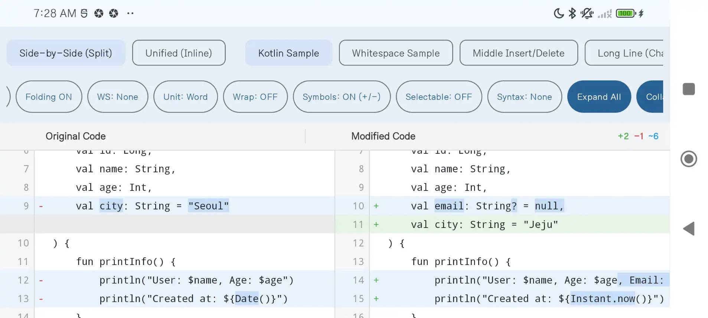
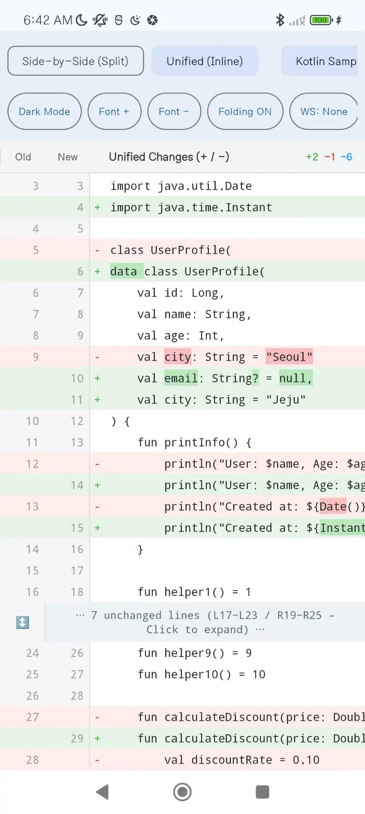
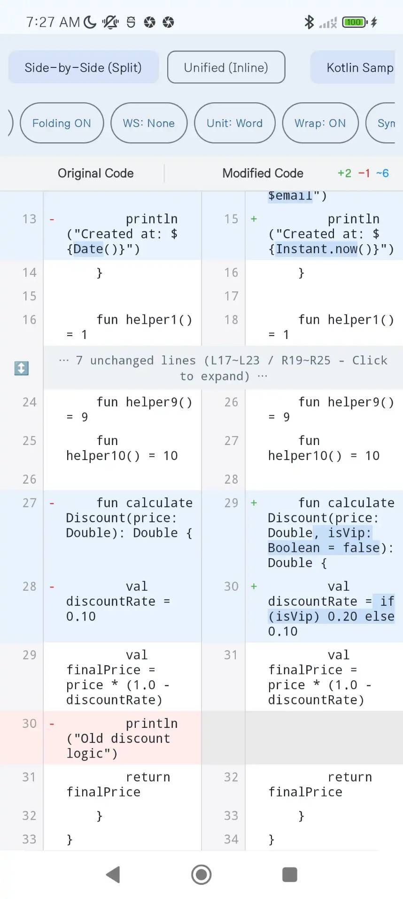

# DiffView

Android Studio Diff Editor 스타일의 **Side-by-Side (Split) & Unified DiffView** Android 라이브러리입니다.

[](https://jitpack.io/#dajkim76/DiffView)
[](https://opensource.org/licenses/Apache-2.0)

---

## 🌟 주요 기능
0. Powered by A.I 
   - 대부분의 코드는 **Gemini 3.7 Flash** 로 생성했습니다. 문제가 있다면 코드를 clone에서 A.I를 통해서 개선하세요. 이 문서의 초기 버전도 A.I로 작성됬습니다. 코드의 많은 부분은 충분한 코드 리뷰 없이 개발자 테스트만 거치고 commit했으므로 사용 적에 따라 테스트가 더 필요할 수있습니다.
1. **2가지 Diff 모드 지원**:
   - **Side-by-Side (Split) 모드**: 좌(Original) / 우(Modified) 2열 나란히 표시하며 좌우 라인을 완벽 정렬.
   - **Unified (통합 위아래) 모드**: 하나의 뷰 안에서 변경 사항을 위아래 단일 열(`+` / `-`)로 표시.
2. **세로 스크롤 완전 동기화**:
   - 단일 `RecyclerView` 기반 뷰 재활용 구조로 좌우 세로 스크롤이 1px의 오차 없이 완벽히 동기화되며, 수만 줄의 대용량 파일도 부드럽게 렌더링.
3. **컬럼/뷰 단위 가로 스크롤 동기화**:
   - 짧은 줄이든 긴 줄이든 동일한 가상 캔버스 너비를 공유하여, 어느 줄을 잡고 드래그해도 해당 사이드의 모든 줄이 일체형으로 함께 가로 스크롤됨.
   - 좌측과 우측의 가로 스크롤은 서로 독립적으로 동작.
4. **인라인 Diff (단어/문자 단위 하이라이트 & 비교 단위 변경)**:
   - 변경된(`MODIFIED`) 라인에 대해 단어(`WORD`, 기본값) 또는 문자(`CHARACTER`) 단위 LCS 알고리즘을 적용하여 실제로 수정된 텍스트 부분만 정밀하게 하이라이트.
   - `setDiffGranularity(DiffGranularity.WORD)` / `setDiffGranularity(DiffGranularity.CHARACTER)`를 통해 동적으로 비교 단위 전환 가능.
5. **Git / Android Studio 스타일 Context-aware Folding (미변경 라인 접기)**:
   - 변경점 주변의 앞/뒤 문맥 라인(`contextLines`, 기본 3줄)은 유지하고, 중간의 긴 미변경 구간만 `⋯ N lines unchanged ⋯` 배너로 접기.
   - 배너 클릭 시 개별 블록 펼치기/접기 및 전체 일괄 펼치기/접기 지원.
6. **4가지 공백 무시 비교 옵션 (Whitespace Ignore Mode)**:
   - `NONE`: 공백 엄격 비교 (기본값)
   - `TRIM_LEADING_TRAILING`: 라인 앞/뒤 들여쓰기 공백 무시
   - `COLLAPSE_WHITESPACE`: 연속된 공백 개수 무시
   - `IGNORE_ALL`: 모든 공백 문자 무시
7. **Line Wrap (자동 줄 바꿈) 지원**:
   - `setLineWrap(true)`를 통해 긴 코드 라인을 가로 스크롤 대신 화면 너비에 맞춰 아래로 자동 줄 바꿈 가능.
8. **다양한 언어의 Syntax Highlighting & Dark Theme 지원**:
   - 기본값은 순수 텍스트(`PlainTextSyntaxHighlighter`)이며, 주요 프로그래밍 언어의 하이라이터를 기본 내장:
     - Kotlin (`KotlinSyntaxHighlighter`)
     - Java (`JavaSyntaxHighlighter`)
     - JavaScript / TypeScript (`JavaScriptSyntaxHighlighter`)
     - Python (`PythonSyntaxHighlighter`)
     - C / C++ (`CppSyntaxHighlighter`)
     - C# (`CSharpSyntaxHighlighter`)
     - 파일명/확장자 기반 자동 선택: `SyntaxHighlighter.forFileName("main.py")` 또는 `SyntaxHighlighter.forExtension("js")`
9. **UI 문자열/라벨 커스터마이징 & 다국어 지원**:
   - `DiffLabels` 설정 클래스 또는 `setDiffLabels()`, `setHeaderTitles()`, `setUnifiedHeaderTitle()` API를 통해 헤더, 접기 배너 포맷 등 모든 UI 텍스트 커스텀 가능.
   - `strings.xml` 및 한국어 `values-ko/strings.xml` 리소스 기본 내장 (앱에서 오버라이드 지원).
10. **줄 번호 옆 변경 기호(`-` / `+`) 표시**:
    - `setShowDiffSymbols(true)`를 통해 Side-by-Side 모드에서 각 라인의 변경 상태(`-` 삭제 / `+` 추가)를 줄 번호 옆에 함께 표시.
11. **줄 번호(Gutter) 너비 조절**:
    - `setGutterWidthDp(50)`을 통해 줄 번호 영역의 너비를 원하는 크기로 자유롭게 조정.
12. **텍스트 선택 및 복사 제어**:
    - `setTextIsSelectable(true)`를 통해 코드 텍스트 드래그 선택 및 복사 기능 활성화/비활성화 (기본값: `false`).
13. Screenshots




---

## 📦 JitPack 라이브러리 설치 방법

### 1. `settings.gradle.kts`에 JitPack 저장소 추가

```kotlin
dependencyResolutionManagement {
    repositoriesMode.set(RepositoriesMode.FAIL_ON_PROJECT_REPOS)
    repositories {
        google()
        mavenCentral()
        maven { url = uri("https://jitpack.io") }
    }
}
```

### 2. `build.gradle.kts` (Module :app)에 라이브러리 추가

```kotlin
dependencies {
    implementation("com.github.dajkim76:DiffView:1.0.3")
}
```

---

## 📁 프로젝트 구조

```text
DiffView/
├── diffview/                     # 📦 핵심 Android Library 모듈 (배포 대상)
│   └── src/main/java/com/mdiwebma/diffview/
│       ├── DiffView.kt                   # 최종 커스텀 FrameLayout 뷰 컴포넌트
│       ├── DiffViewAdapter.kt            # Side-by-Side & Unified 지원 RecyclerView 어댑터
│       ├── DiffColors.kt                 # Android Studio Light / Dark 색상 테마 팔레트
│       ├── DiffLabels.kt                 # UI 텍스트/라벨 커스터마이징 및 다국어 지원 모델
│       ├── SyntaxHighlighter.kt          # 문법 하이라이팅 인터페이스 및 Kotlin 구현체
│       ├── FoldingManager.kt             # Git/AS 스타일 문맥 기반 라인 접기 매니저
│       ├── SyncHorizontalScrollView.kt   # 컬럼 단위 가로 스크롤 동기화 ScrollView & Manager
│       ├── model/DiffModels.kt           # DiffRow, DiffLine, DiffMode, WhitespaceIgnoreMode 등 모델
│       └── engine/                       # DiffEngine, KotlinDiffEngine, InlineDiffCalculator
│
└── app/                          # 📱 데모 / 샘플 애플리케이션 (Android View & Compose 데모)
```

---

## 🚀 기본 사용법

### 1. XML 레이아웃에 추가

```xml
<com.mdiwebma.diffview.DiffView
    android:id="@+id/diffView"
    android:layout_width="match_parent"
    android:layout_height="match_parent" />
```

### 2. Kotlin 코드에서 제어

```kotlin
import com.mdiwebma.diffview.KotlinSyntaxHighlighter
import com.mdiwebma.diffview.DiffColors
import com.mdiwebma.diffview.DiffView
import com.mdiwebma.diffview.model.DiffMode
import com.mdiwebma.diffview.model.WhitespaceIgnoreMode

val diffView = findViewById<DiffView>(R.id.diffView)

// 1. 원본 및 수정본 소스 코드 설정 (비동기 계산 및 렌더링)
val originalCode = """
    fun calculate(x: Int): Int {
        return x * 2
    }
""".trimIndent()

val modifiedCode = """
    fun calculate(x: Int, factor: Int = 2): Int {
        return x * factor
    }
""".trimIndent()

diffView.setContent(original = originalCode, modified = modifiedCode)

// 2. Diff 모드 설정 (기본값: SIDE_BY_SIDE)
diffView.setDiffMode(DiffMode.SIDE_BY_SIDE) // 좌우 2열 분할 모드
// diffView.setDiffMode(DiffMode.UNIFIED)    // 위아래 단일 열 통합 모드

// 3. 테마 설정 (Light / Dark), Default(Auto)
diffView.setDiffColors(DiffColors.Dark)

// 4. 글꼴 크기 변경 (SP 단위)
diffView.setTextSize(13f)

// 5. 미변경 라인 접기 설정 (문맥 라인 수, 접기 임계치)
diffView.setFoldingEnabled(enabled = true, contextLines = 3, threshold = 8)

// 6. 전체 펼치기 / 접기
diffView.expandAll()
diffView.collapseAll()

// 7. 공백 무시 비교 옵션 설정 (NONE, TRIM_LEADING_TRAILING, COLLAPSE_WHITESPACE, IGNORE_ALL)
diffView.setWhitespaceIgnoreMode(WhitespaceIgnoreMode.TRIM_LEADING_TRAILING)

// 8. 인라인 Diff 비교 단위 설정 (WORD(기본값) vs CHARACTER)
diffView.setDiffGranularity(DiffGranularity.WORD)

// 9. 자동 줄 바꿈 (Line Wrap) 설정 (기본값: false - 단일 행 가로 스크롤)
diffView.setLineWrap(false)

// 10. 문법 하이라이터 설정 (언어별 하이라이터 또는 파일명 기반 자동 감지)
diffView.setSyntaxHighlighter(KotlinSyntaxHighlighter())
// diffView.setSyntaxHighlighter(SyntaxHighlighter.forFileName("App.js"))
// diffView.setSyntaxHighlighter(PythonSyntaxHighlighter())
// diffView.setSyntaxHighlighter(JavaSyntaxHighlighter())
// diffView.setSyntaxHighlighter(CppSyntaxHighlighter())
// diffView.setSyntaxHighlighter(CSharpSyntaxHighlighter())

// 11. UI 라벨/문자열 커스터마이징 (또는 strings.xml 오버라이드 지원)
diffView.setDiffLabels(
    DiffLabels(
        originalHeader = "Before",
        modifiedHeader = "After",
        unifiedHeader = "Unified",
        foldedBannerFormatter = { count, left, right -> "⋯ $count lines collapsed ($left / $right) ⋯" }
    )
)

// 12. 줄 번호 옆 변경 기호(- / +) 표시 설정 (기본값: true)
diffView.setShowDiffSymbols(true)

// 13. 줄 번호(Gutter) 영역 너비 조절 (DP 단위, 기본값: 48)
diffView.setGutterWidthDp(50)

// 14. 텍스트 드래그 선택 및 복사 활성화 여부 (기본값: false)
diffView.setTextIsSelectable(true)
```

---

## 📄 License

```text
Copyright 2026 DiffView Project (dajkim76)

Licensed under the Apache License, Version 2.0 (the "License");
you may not use this file except in compliance with the License.
You may obtain a copy of the License at

    http://www.apache.org/licenses/LICENSE-2.0

Unless required by applicable law or agreed to in writing, software
distributed under the License is distributed on an "AS IS" BASIS,
WITHOUT WARRANTIES OR CONDITIONS OF ANY KIND, either express or implied.
See the License for the specific language governing permissions and
limitations under the License.
```
